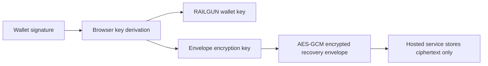

# Hidden Manifest Security Kit

[](https://github.com/hiddenmanifest/hiddenmanifest-security-kit/actions/workflows/ci.yml)

Public, audit-ready source-available security code for Hidden Manifest.

This repository contains the client-side and contract-shape code that users and auditors should be able to inspect: vault key derivation, encrypted recovery envelopes, browser RAILGUN boundaries, transaction safety helpers, and API contracts.

It intentionally does not include the hosted product backend, production routing, hosted service operations, market-data workers, Redis storage, Phoenix API, deployment configuration, or private infrastructure.

## What This Proves

This repo is designed to make Hidden Manifest's core vault security claims inspectable:

- Vault unlock keys are derived in the browser from wallet signatures.
- Recovery envelopes store encrypted vault material, not plaintext recovery phrases.
- The hosted service cannot decrypt a recovery envelope without the wallet-derived key.
- Spend-capable RAILGUN operations are represented as browser-side boundaries.
- Public API contracts can be reviewed without exposing production service internals.



## Packages

- `@hiddenmanifest/vault-crypto` - vault envelope types, key derivation, AES-GCM helpers, mnemonic/salt generation, and stable recovery messages.
- `@hiddenmanifest/railgun-browser` - browser-only RAILGUN worker command types, runtime parameters, storage abstraction, prover loader, and worker client shell.
- `@hiddenmanifest/transaction-safety` - address, amount, native-token, allowance, explorer, chain, and transaction intent helpers.
- `@hiddenmanifest/api-contracts` - public request/response contracts, bigint serialization, and mock fixtures.

## Development

```bash
pnpm install
pnpm check
pnpm build
pnpm test
pnpm lint
```

## Audit Boundary

The code here is intended to make these claims inspectable:

- Vault keys are derived in the browser from wallet signatures.
- Encrypted vault recovery envelopes cannot be decrypted by the hosted service alone.
- Browser-side RAILGUN operations are separated from hosted routing and infrastructure.
- Public API contracts can be reviewed without exposing production adapters.

Read:

- [Security model](docs/security-model.md)
- [Security claims](docs/security-claims.md)
- [Vault envelope](docs/vault-envelope.md)
- [Non-goals](docs/non-goals.md)

## License

Source-available audit license

